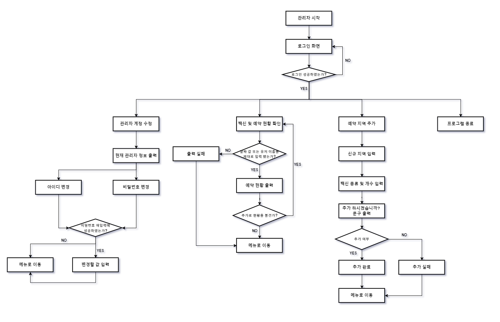
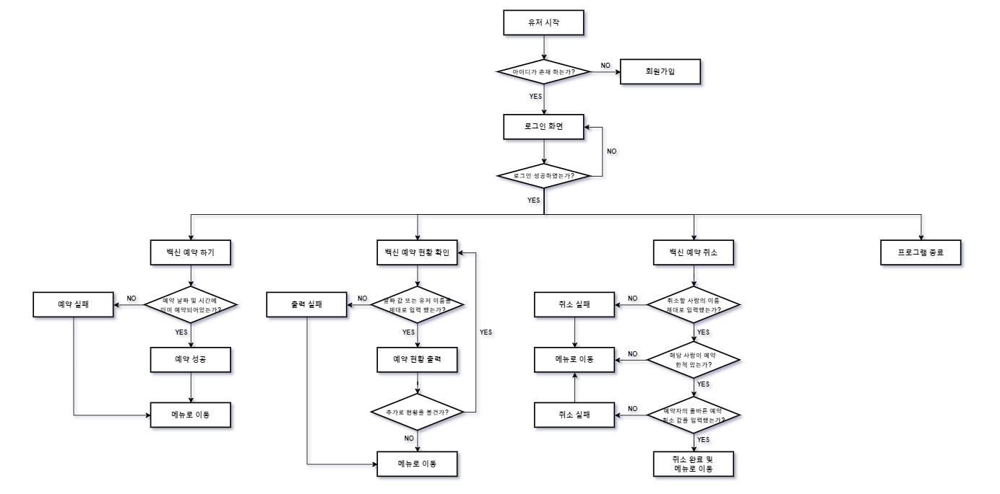

# 코로나 백신 예약 프로그램

* 목적: 코로나 백신 예약 프로그램을 작성하여 자바 코드 작성 연습을 한다. 
* 시작 기간: 2022.01.07
* 목표 기간: 2022.01.16

# 기능

해당 프로그램의 기능은 크게 `root`와 `user`로 나뉜다. 각각의 기능 세부사항은 다음과 같다. 

## root 기능

1. 관리자 계정 수정 **(완료)**
    * 설명: 관리자의 아이디와 비밀번호를 변경한다. (default: id/pwd = admin/admin)
2. 백신 및 예약 현황 확인 
    * 설명: 현재 예약 현황을 (전체/날짜/유저) 기반으로 출력하고, 남은 백신 현황 또한 출력한다.
3. 예약 지역 추가
    * 설명: 새롭게 추가된 예약 지역 및 백신 현황을 추가한다.
4. 프로그램 종료
    * 설명: 프로그램을 종료한다. 

## user 기능

1. 백신 예약하기
    * 설명: 날짜 및 장소를 선택하여 백신을 예약한다.
2. 백신 예약 취소
    * 설명: 자신이 설정한 백신 예약 날짜를 취소한다. 
3. 백신 예약 현황 확인
    * 설명: 현재 예약 현황을 (전체/날짜/유저) 기반으로 출력하고, 남은 백신 현황 또한 출력한다.
4. 프로그램 종료
    * 설명: 프로그램을 종료한다.
 
# Flow Chart

해당 프로그램의 플로우 차트는 다음과 같다. 

**[그림 1. root flow chart]**

**[그림 2. user flow chart]**

